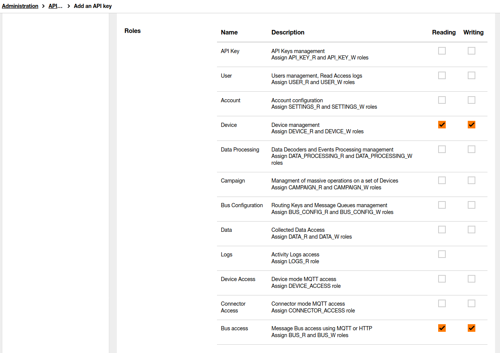

## Table of contents
* [General info](#general-info)
* [Technologies](#technologies)
* [Requirements](#requirements)
* [Building and installation](#building-and-installation)
* [Configuration](#configuration)
  * [Connector side](#connector-side) 
    * [Application](#application)
    * [Synchronization of undelivered callbacks](#synchronization-of-undelivered-callbacks)
    * [Logging](#logging)
  * [Sigfox side](#sigfox-side)
    * [Custom callback](#custom-callback)
* [Launching](#launching)
* [Deploy on Google Cloud Platform](#deploy-on-google-cloud-platform)

## General info
This repository contains everything you need to create 'Sigfox to Live Objects' connector. This connector was designed to synchronize data between Sigfox and Live Objects Platform. Current version of connector allows to make one way synchronization - we can synchronize information from Sigfox to Live Objects. 

Main features are:
* **devices synchronization** - every device created in Sigfox will appear in LO and every device deleted from Sigfox will be also deleted from LO
* **messages synchronization** - every message which will be send from device to Sigfox will appear in LO

One connector can handle only one Sigfox account and one Live Objects account.

It can be only one instance of connector per Live Objects account. Two or more instances connected to the same Live Objects account will cause problems.

The connector stores messages that failed to sync in the local database. They are sent again according to the synchronization interval set in the configuration.

The software is an open source toolbox which has to be integrated into an end to end solution. The ordering of messages is not guaranteed to be preserved; the application uses thread pools to run its Sigfox and Live Objects adapters which may cause some messages to arrive in Live Objects out of order in which they were kept within Sigfox.

## Technologies
* Java 8
* Spring Boot 2.4.2


## Requirements
In order to run the connector you need to have:
* **Live Objects account**
* **Sigfox account** 


## Installation package

The installation package can be acquired in one of two ways:

### Release

It can be downloaded from https://github.com/DatavenueLiveObjects/Sigfox-Live-Objects-connector/releases

### Building

It can be created by running the command:
```
mvn clean package -Prelease
```
After running this command, the file  `sigfox2lo-[VERSION].zip` will be created in the target directory. 

## Installation

The file downloaded/created above should be placed where the connector will be started, and then unpacked. You can deploy this connector wherever you want (local server, cloud provider etc.).

After unpacking the archive, you should get a structure similar to this:
```
bin/
conf/
data/
lib/
```

## Configuration

To start synchronization between Sigfox and Live Objects, you need to configure Live Objects API key and Sigfox API login and password in the `application.yaml` file.  
You also need to add a `custom callback` on the Sigfox side.  
As you know, the connector stores messages in the local database, so you should also set the username and password for the database in the `application.yaml` file.

### Connector side
#### Application
Configuration can be found in **application.yaml** file located in `conf/` directory.
```
1     server:
2       port: 8080
3     spring:
4       application:
5         name: sigfox2Lo
6       datasource:
7         url: jdbc:h2:file:${basedir:.}/data/sigfox-connector-db
8         username: YOUR_DB_USERNAME
9         password: YOUR_DB_PASSWORD
10        driverClassName: org.h2.Driver
11      jpa:
12        hibernate:
13          ddl-auto: update
14
15    lo:
16      hostname: liveobjects.orange-business.com
17      api-key: YOUR_API_KEY
18      device-group: _YOUR_DEVICE_GROUP_NAME
19      synchronization-interval: 60000
20      synchronization-thread-pool-size: 40
21      message-retry-days: 10
22      page-size: 20
23      message-qos: 1  
24      mqtt-persistence-dir: ${basedir:.}/temp/
25
26    sigfox:
27      hostname: https://api.sigfox.com/v2
28      login: YOUR_SIGFOX_LOGIN
29      password: YOUR_SIGFOX_PASSWORD
```
You can change all values but the most important lines are:

**2** - Tomcat port  
**8** - Local DB username  
**9** - Local DB password  
**16** - Live Objects hostname  
**17** - Live Objects API key with at least DEVICE_R, DEVICE_W, BUS_R and BUS_W roles.  
**27** - Sigfox API hostname  
**28** - Sigfox API login  
**29** - Sigfox API Password  

#### Generate Live Objects API key
Login to Live Objects Web Portal and go to **Administration** -> **API keys**  
  
Click **Add** button and fill fields.  

To  validate  the  creation  of  the  key,  click  on  the **Create** button.  Your  key  is  generated  in  the form of an alphanumeric sequence and a QR code.
#### Sigfox API login and password
Login to Sigfox Web Portal and go to **GROUP** -> **Your group name** -> **API ACCESS** -> Click **NEW** on the top right of the screen.  

You should set the permissions that allow you to retrieve device data and undelivered callbacks.

#### Synchronization of undelivered callbacks
The first time the connector is started, any undelivered callbacks are downloaded. To limit the range of downloaded callbacks, you can set the starting timestamp in milliseconds  in the `sync.properties` file. 
```
lastSyncTime=0
```

#### Logging
Logging configuration can be found in **logback.xml** file located in `conf/` directory. You can find more information about how to configure your logs [here](http://logback.qos.ch/manual/configuration.html)

### Sigfox side
In order to send messages from Sigfox to the connector, a custom callback must be defined.
#### Custom callback
Login to Sigfox Web Portal and go to **DEVICE TYPE** -> **Your type name** -> **CALLBACKS** -> Click **NEW** on the top right of the screen.

Choose a custom callback

Complete the displayed form

In the Type fields, set the `Data` `Uplink`. Set the Use HTTP Method field to `POST`. Then in the Url pattern field, put the `address where your connector is available`.
The last thing is to configure the content field correctly. Paste the `value given below` there.
```
{
  "device": "{device}",
  "deviceTypeId": "{deviceTypeId}",
  "seqNumber": {seqNumber},
  "time": {time},   
  "data" : "{data}"
}
```

## Launching
In order to run the connector, use the `app.sh` file for linux or `app.bat` if you are using windows. These files are located in the `bin/` directory.

## Deploy on Google Cloud Platform 
You can deploy this connector wherever you want (local server, cloud provider etc.). As an example we provide scripts to deploy this connector on Google Cloud Platform. These scripts are located in `gcp` directory. 

- First of all you need to have Google Cloud account. 
- Second thing is to install [Google Cloud SDK](https://cloud.google.com/sdk).
- After that you should provide correct parameters in `application.yaml`. 
- Last thing is run `start.sh` script. After a while you will get informations about creating virtual machine named `sigfox2lo` and IP address. You will also see this machine in Google Cloud Platform Console. 
- If you want to stop (and delete) this machine you should run `stop.sh` script.


